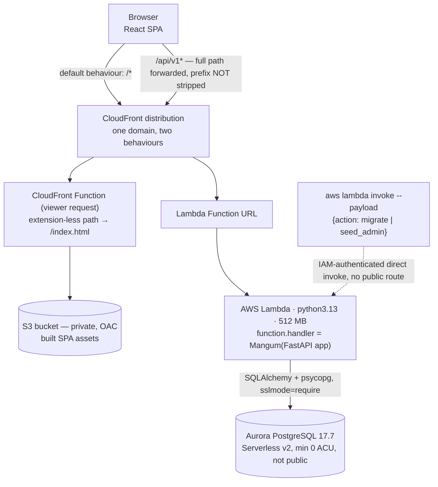
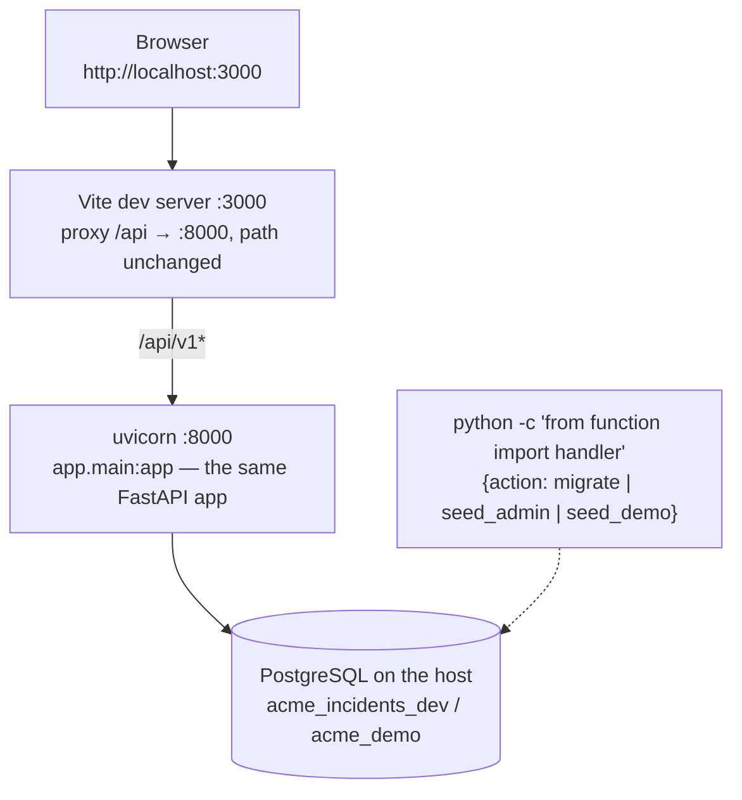
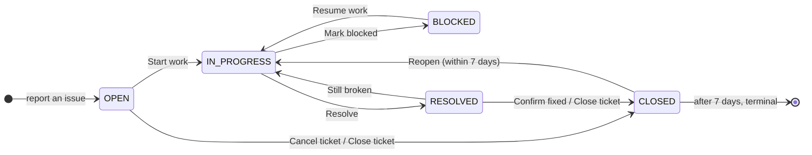

# ACME Facility Incident Management

A web application for reporting and resolving workplace facility issues at ACME Inc.
An employee reports that a meeting-room projector is dead; a facility admin or an
engineering lead gets it to the right engineer; the engineer works it, blocks it if they
are waiting on a part, resolves it; the person who reported it confirms the fix. Every
step is recorded, and the admin dashboard answers the questions a facilities team
actually has: what is open, where the problems are, who is overloaded, how long things
take, and what is stuck.

Built inside the [Citi coding-workshop scaffold](#upstream-scaffold-and-licence) — see
that section for what is ours and what is the template's.

**Status.** Milestones M1–M7 are complete and verified locally; this README is M8.
**The application has never been deployed to AWS** — no credentials were issued for this
run. Everything that needs the cloud is written down, with the exact command and the
expected result, in [docs/DEPLOYMENT-CHECKLIST.md](./docs/DEPLOYMENT-CHECKLIST.md).
See [Known limitations](#known-limitations).

| | |
| --- | --- |
| **Backend** | Python 3.13, FastAPI, SQLAlchemy 2.0, Alembic, PostgreSQL — one Lambda, 41 paths / 61 operations under `/api/v1` |
| **Frontend** | React 19 + TypeScript, Vite, Material UI, TanStack Query, react-responsive |
| **Tests** | 683 backend (pytest) · 271 frontend (Vitest) · 25 end-to-end (Playwright, two viewports) |
| **Docs** | [Build plan](./docs/BUILD-PLAN.md) · [Project guide](./docs/PROJECT-GUIDE.md) · [Decision log](./docs/DECISION-LOG.md) · [Deployment checklist](./docs/DEPLOYMENT-CHECKLIST.md) · [Demo script](./docs/DEMO-SCRIPT.md) |

**Contents** — [What it does](#what-it-does) · [Architecture](#architecture) ·
[Roles and permissions](#roles-and-permissions) · [The incident workflow](#the-incident-workflow) ·
[Getting started locally](#getting-started-locally) · [Testing](#testing) ·
[Trade-offs and decisions](#trade-offs-and-decisions) · [Known limitations](#known-limitations) ·
[Upstream scaffold and licence](#upstream-scaffold-and-licence)

---

## What it does

Three personas, one ticket.

- **Employee** — reports an issue through a guided questionnaire (what kind of problem →
  which one → where → tell us more → how urgent), watches their tickets, and confirms or
  rejects the fix. Self-registration is open to `@acme.inc` addresses and always produces
  an employee.
- **Engineer** — works a queue. Seniors and leads pick up unassigned tickets in their
  specialties; leads also assign their team. Engineers see internal notes that employees
  never do.
- **Facility admin** — defines the world (buildings → floors → seats, category tree,
  engineer accounts), assigns and escalates anything, and reads the dashboard.

The data model is buildings/floors/seats, a two-level category tree, incidents with a
status/priority/escalation state, notes with public-or-internal visibility, and an
append-only event log that every timing metric is computed from. Full schema:
[BUILD-PLAN §3](./docs/BUILD-PLAN.md).

## Architecture

### Deployed (AWS) — designed and configured, not yet verified



One CloudFront distribution serves both the SPA and the API, so the browser sees a single
origin: no CORS, and a `SameSite=Strict; HttpOnly` refresh cookie that actually works.
Migrations and seeding never run from a laptop — Aurora is `publicly_accessible = false`,
so they go through an IAM-protected direct invoke of the same Lambda
(`backend/v1/function.py` dispatches on an `action` key before handing anything to Mangum).

### Local development



### How the two differ

| | Local | Deployed |
| --- | --- | --- |
| Same-origin for the browser | Vite dev proxy | One CloudFront distribution |
| Static assets | Vite dev server (HMR) | S3 behind CloudFront, private with OAC |
| API entry | uvicorn on `:8000` | Lambda Function URL behind CloudFront |
| API path | `/api/v1/...` | `/api/v1/...` — identical, deliberately |
| Database | PostgreSQL on the host | Aurora PostgreSQL 17.7, private, ~15 s cold start |
| TLS to the database | none | `sslmode=require` |
| Refresh cookie | `Secure=false` (HTTP) | `Secure=true` |
| Migrations | `handler({"action": "migrate"})` in-process | `aws lambda invoke` with the same payload |
| `seed_demo` | allowed | **refused** — `_op_seed_demo` checks `settings.is_local` |
| Config source | `backend/v1/.env` (gitignored) | env vars injected by `infra/locals.tf` |

The single switch is `IS_LOCAL`. It drives `sslmode`, the cookie's `Secure` flag, the
refusal to start with a weak `JWT_SECRET`, and the `seed_demo` guard — one answer in the
codebase to "is this production", not four.

The paths are identical on purpose: `infra/cloudfront.tf` forwards `/api/v1*` to the
Lambda **without stripping the prefix**, so the application owns the whole path in both
environments. The scaffold ships `bin/proxy-server.js`, which strips it; this project
deliberately does not use it.

### Code layout

Layer-first on the backend, feature-first on the frontend.

```
backend/v1/                    # the single auto-discovered Lambda
├── function.py                # handler = Mangum(app) + ops-action dispatch
├── requirements.txt           #   runtime deps only — Terraform packages this file
├── requirements-dev.txt       #   test/lint deps, never packaged
├── alembic/versions/          # migrations; the test suite runs them, not create_all()
├── app/
│   ├── main.py config.py db.py errors.py workflow.py
│   ├── routers/     auth categories engineers facilities health incidents notes reports users
│   ├── services/    incident_service assignment categories engineers facilities notes
│   │                ops reporting users visibility auth_service health
│   ├── repositories/  incidents facilities engineers reports
│   ├── models/ schemas/ security/ seed/
│   └── migrations.py
└── tests/  unit/ (6 files)  integration/ (15 files)  conftest.py  factories.py

frontend/
├── vite.config.ts             # dev proxy + Vitest config
├── playwright.config.ts       # two viewport projects, starts/reuses the stack
├── e2e/                       # lifecycle · assignment · dashboards · responsive
└── src/
    ├── api/  auth/  components/  display/  hooks/  layout/
    └── features/  incidents facilities categories engineers users home dashboard auth status
```

Three rules hold this together, and each is enforced in exactly one file:

| Rule | Lives in |
| --- | --- |
| What may happen to a ticket, and who may do it | `backend/v1/app/workflow.py` (a data table) |
| Which rows a user may read | `backend/v1/app/services/visibility.py` (applied to the query, never a serializer) |
| Which actions the UI offers | `GET /api/v1/incidents/{id}/allowed-transitions` — the frontend renders buttons and dialog fields **only** from this response |

## Roles and permissions

Three roles: `EMPLOYEE`, `ENGINEER` (levels `JUNIOR`, `SENIOR`, `LEAD`), `FACILITY_ADMIN`.
Role failures return **403**. Enforcement is a FastAPI dependency (`require_roles(*roles)`
in `app/security/dependencies.py`) plus ownership and level checks in the service layer —
never in a route body.

| Action | Employee | Engineer | Facility Admin |
| --- | --- | --- | --- |
| Self-register | `@acme.inc` only | no — created by an admin | no — seeded or promoted |
| Create a ticket | yes | yes | yes |
| Read tickets | all of them; **public notes only** | all of them; public **+ internal** notes | all |
| Edit title / description / category / location | own, while OPEN **and** unassigned | no | any, any time |
| Set priority at creation | yes | yes | yes |
| Change priority later | own, while OPEN | no | any, any time |
| Escalate (flag with a reason) | own, while OPEN / IN_PROGRESS / BLOCKED | no | yes |
| Clear an escalation | no | no | yes |
| Pick up an unassigned OPEN ticket | no | SENIOR, LEAD | — |
| Assign or reassign someone else | no | **LEAD only**, any non-CLOSED ticket | yes |
| Change status | per the [workflow](#the-incident-workflow) | per the workflow | per the workflow |
| Add a public note | own ticket, unless CLOSED | assigned tickets; LEAD: any | any, unless CLOSED |
| Add an internal note | **no** | yes | yes |
| Edit or delete own note | within 15 minutes | within 15 minutes | any note, any time |
| Buildings, floors, seats, categories | read | read | full CRUD |
| Engineer profiles | no | read all; update own availability and phone | full CRUD |
| Users | no | no | list, change role, deactivate |
| Dashboard | own home | own home (+ Team page for LEAD) | admin dashboard and all eight reports |

Two things that look like omissions and are not:

- **Every signed-in user can read every ticket.** `apply_incident_visibility()` returns
  the query unchanged today, on purpose: the brief asks employees to be able to check
  whether something is already reported. What an employee cannot do is *act* on someone
  else's ticket, which is a permission question answered by the `can_edit` / `can_escalate`
  / `can_change_priority` flags on the detail response. The function exists, and every
  incident query goes through it, so per-building scoping later is one function to change
  rather than an audit of every query.
- **Internal notes are filtered in SQL, not in the serializer.** `apply_note_visibility()`
  adds a `WHERE` clause. A serializer-side filter would still load the row, still count it
  in `total`, and still page over it.

**Assignment rules** (`app/services/assignment.py`) — the target must be an active
engineer (`ASSIGNEE_NOT_ENGINEER` otherwise); JUNIOR engineers can never assign; SENIOR may
assign only *themselves*, and only to an unassigned OPEN ticket; LEAD and admins may assign
anyone to any non-CLOSED ticket. Assigning someone who is BUSY / ON_LEAVE, or at their
`max_active_tickets`, **succeeds** and returns `warnings: [...]` for the UI to show: a lead
looking at their team knows things the system does not.

**Authentication.** Access token: JWT HS256, 15 minutes, held in memory by the SPA only.
Refresh token: a random 32-byte string stored hashed, 7-day expiry, in an
`HttpOnly; SameSite=Strict` cookie scoped to `/api/v1/auth`, rotated on every use with
reuse detection. Passwords: bcrypt, cost 12. Accounts created by an admin (and the seeded
first admin) carry `must_change_password`, and every endpoint outside `/auth/*` answers
**403 `PASSWORD_CHANGE_REQUIRED`** until it is cleared. Engineer *level* is read from the
database per request, never trusted from the token.

## The incident workflow

`backend/v1/app/workflow.py` is the single source of truth: a frozen `TRANSITIONS` table
read by the service that executes a move, by the endpoint that tells the UI which buttons
to draw, and by the tests, which parametrise over the table itself. Adding a transition is
one row plus one test — no route changes, no React changes.



Every row of the shipped table, in table order:

| From → To | Button | Who | Required input | Effect |
| --- | --- | --- | --- | --- |
| OPEN → IN_PROGRESS | Start work | assignee, admin | — (**guard**: the ticket must have an assignee) | sets `acknowledged_at` if unset |
| OPEN → CLOSED | Cancel ticket | reporter | — | `close_reason = CANCELLED_BY_REPORTER` |
| OPEN → CLOSED | Close ticket | admin | `close_reason` ∈ DUPLICATE / INVALID / ADMIN_CLOSED (DUPLICATE also needs `duplicate_of_id`) | sets `closed_at` |
| IN_PROGRESS → BLOCKED | Mark blocked | assignee, admin | `blocked_reason_type`, `blocked_reason` | — |
| BLOCKED → IN_PROGRESS | Resume work | assignee, admin | — | clears the blocked fields (the event log keeps the history) |
| IN_PROGRESS → RESOLVED | Resolve | assignee, admin | `resolution_summary` | sets `resolved_at` |
| RESOLVED → CLOSED | Confirm fixed | reporter | — | `close_reason = CONFIRMED_FIXED` |
| RESOLVED → CLOSED | Close ticket | assignee | — | `close_reason = CLOSED_BY_ENGINEER` |
| RESOLVED → CLOSED | Close ticket | admin | — | `close_reason = ADMIN_CLOSED` |
| RESOLVED → IN_PROGRESS | Still broken | reporter, admin | `reason` | `reopen_count += 1`, clears `resolved_at`, writes a REOPENED event |
| CLOSED → IN_PROGRESS | Reopen | reporter, admin | `reason` (**guard**: within 7 days of `closed_at`) | `reopen_count += 1`, clears `resolved_at` / `closed_at` |

Four details that are easy to miss and are all in the code:

- **"Who" is an actor, not a role.** `REPORTER` and `ASSIGNEE` are relationships to *this*
  ticket; the same person is a different actor on a different one. A **LEAD engineer counts
  as `ASSIGNEE` on any ticket**, assigned or not, so a team is not stuck when someone is on
  leave.
- **One user can be several actors** — an admin who reported the ticket is both.
  `ACTOR_PRECEDENCE` (admin → assignee → reporter) picks the row, widest powers first, so
  being the reporter never costs an admin an option. The visible consequence: an admin
  closing a ticket they reported records `ADMIN_CLOSED`, not `CONFIRMED_FIXED`.
- **Guards are conditions on the ticket, not input from the caller**, and they take `now`
  as an argument — which is how the 7-day reopen window is tested without waiting a week.
  A move whose guard currently fails is *not offered*, rather than offered and refused.
- **Anything else is a 409** carrying `allowed_transitions`, and every accepted move writes
  an `incident_events` row with from/to and reason.

## Getting started locally

**Prerequisites** — PostgreSQL (17 or newer; developed against 18.6, CI runs 17, Aurora is
17.7), Python 3.13, Node 22. No Docker, no `docker-compose.yml`, no LocalStack: the
database runs natively on the host and the app is two processes.

### 1. Create the database

The application never creates its own database.

```sh
# `postgres123` is the default in app/config.py, matching what infra/locals.tf
# injects for the local case.
sudo -u postgres psql -c "ALTER USER postgres PASSWORD 'postgres123';"
sudo -u postgres createdb acme_incidents_dev
```

It must exist and be **empty** — the schema arrives in step 3.

### 2. Configure and install the backend

```sh
cd backend/v1
python3 -m venv .venv
.venv/bin/pip install -r requirements-dev.txt   # includes requirements.txt
cp .env.example .env
```

**Do not skip the `.env` copy.** `app/config.py` defaults `POSTGRES_NAME` to `postgres` —
the cluster's empty maintenance database — because that is what the deployed environment
would use if Terraform injected nothing. With the default in place the API starts,
`/api/v1/health` reports healthy (it only proves the connection works), and then every
real query fails on a missing table.
[`.env.example`](./backend/v1/.env.example) documents every setting; the only one you
normally need is `POSTGRES_NAME=acme_incidents_dev`.

`.env` is gitignored, and it never reaches the Lambda either: `infra/locals.tf` excludes
dot-prefixed files from the deployment package and injects the same names directly.

### 3. Create the schema and the first admin

Both run through the ops actions in `app/services/ops.py` — the same code path the deployed
Lambda uses, invoked locally here:

```sh
cd backend/v1
.venv/bin/python -c "from function import handler; print(handler({'action': 'migrate'}, None))"
.venv/bin/python -c "from function import handler; print(handler({'action': 'seed_admin', 'email': 'admin@acme.inc', 'full_name': 'Facility Admin'}, None))"
```

`migrate` upgrades the schema to head and seeds the category reference data (5 groups and 32
subcategories); both halves are idempotent, so re-running is safe. `seed_admin` prints a
temporary password **once** and flags the account `must_change_password`, so the first
sign-in must change it. Self-registration always produces an employee, so this is the only
way to get an admin.

### 4. Run it

```sh
# terminal 1 — API on :8000
cd backend/v1 && .venv/bin/uvicorn app.main:app --reload --port 8000

# terminal 2 — UI on :3000, proxying /api to :8000 with the path unchanged
cd frontend && npm install && npm run dev
```

Open <http://localhost:3000>. Interactive API docs: <http://localhost:8000/api/v1/docs>
(note the `/api/v1` prefix — the application owns the whole path in both environments).

Two ways in: **create an employee account** ("Create one with your ACME address",
`@acme.inc` only), or **use the admin from step 3** — whose first sign-in goes straight to
a change-password screen with no way past it. That is the gate working, not a fault.

### 5. Optional: 90 days of demo data

For a dashboard with shape in it, seed a **separate** database rather than overwriting your
development one:

```sh
sudo -u postgres createdb acme_demo
cd backend/v1
POSTGRES_NAME=acme_demo .venv/bin/python -c "from function import handler; print(handler({'action': 'migrate'}, None))"
POSTGRES_NAME=acme_demo .venv/bin/python -c "from function import handler; print(handler({'action': 'seed_demo'}, None))"
```

That writes 3 buildings, ~14 floors, ~420 desks, ~34 meeting rooms, 1 admin, 6 engineers,
30 employees and 300 incidents over 90 days, with ~1,800 **backdated** event rows, in under
a second. Every account shares the password the payload prints (`AcmeDemo2026!`); the admin
is `demo.admin@acme.inc`. To use it, set `POSTGRES_NAME=acme_demo` in `backend/v1/.env` and
restart uvicorn; change it back afterwards.

`seed_demo` **refuses to run unless `IS_LOCAL` is true**, and it is not idempotent in the
top-up sense: a second run finds its own buildings, writes nothing and says so. To
regenerate, drop the database and repeat. [docs/DEMO-SCRIPT.md](./docs/DEMO-SCRIPT.md) is a
5-minute walkthrough built on this dataset.

### 6. Troubleshooting

| Symptom | Cause |
| --- | --- |
| `relation "users" does not exist` | `POSTGRES_NAME` still points at `postgres`. Copy `.env.example` to `.env` (step 2). |
| `/api/v1/health` healthy but every other call 500s | Same cause: the connection works, the schema is elsewhere. |
| `password authentication failed for user "postgres"` | Step 1's `ALTER USER` was skipped, or `POSTGRES_PASS` does not match. |
| `database "acme_incidents_dev" does not exist` | Step 1's `createdb` was skipped. |
| Sign-in lands on a change-password screen with no way out | Working as designed for a seeded or admin-created account. Complete the form. |
| The app sits on "Restoring your session…" | The first request of a page load is `POST /api/v1/auth/refresh`. Locally that is instant, so a hang means uvicorn is down or the proxy is not reaching it — check `curl localhost:3000/api/v1/health`. |
| `AdminShutdown: terminating connection due to administrator command` in a test | Another `pytest` is using the same test database and dropped it. Check `pgrep -af pytest`, then re-run with your own `POSTGRES_TEST_NAME`. |
| `browserType.launch: Executable doesn't exist` | Playwright's browser downloads separately: `npx playwright install chromium`. |
| A status or priority filter appears to do nothing | The repeatable parameter is being sent as `status[]=`. `api/client.ts` sets `paramsSerializer: { indexes: null }`; check it survived. |
| A new file under `frontend/src/` is invisible to `git add` | The scaffold's `.gitignore` blocks any directory named `lib`. The presentation helpers live in `src/display/` for this reason. |

## Testing

### Commands

```sh
# backend — lint, format check, tests
cd backend/v1
.venv/bin/ruff check . && .venv/bin/ruff format --check .
.venv/bin/python -m pytest

# frontend — lint, types, unit/component tests, production build
cd frontend
npm run lint && npm run typecheck && npm test && npm run build

# end-to-end — a real browser against the running stack
cd frontend
npx playwright install chromium   # once
npm run test:e2e                  # or npm run test:e2e:ui
```

### Results, as of M8

| Suite | Command | Result |
| --- | --- | --- |
| Backend unit + integration | `pytest` | **683 passing** (431 test functions, parametrised) |
| Backend lint + format | `ruff check` / `ruff format --check` | clean |
| Frontend component + hook | `npm test` (Vitest, 29 files) | **271 passing** |
| Frontend lint + types + build | `npm run lint` / `typecheck` / `build` | clean (ESLint, `tsc -b`, `vite build`) |
| End-to-end | `npm run test:e2e` | **25 passing**, 7 deliberate viewport skips, across 4 spec files and 2 viewports (1440×900, 375×812) |

The backend suite takes about five to six minutes, most of it bcrypt at cost 12.
[`.github/workflows/ci.actions.yml`](./.github/workflows/ci.actions.yml) runs the backend
job (PostgreSQL 17 service container → ruff → pytest) and the frontend job (eslint → tsc →
vitest → vite build) on every push and pull request.

### What is covered at each level

- **Backend unit** (`tests/unit/`) — the workflow table parametrised over `TRANSITIONS`
  itself, so a row added without a test is not possible; the 7-day reopen window against an
  injected fixed `now`; email-domain validation including lookalikes (`x@sub.acme.inc`,
  `x@acme.inc.evil.com`); password hashing; token encode/decode and expiry; config
  (including the refusal to start deployed with a weak `JWT_SECRET`); the ops dispatcher.
- **Backend integration** (`tests/integration/`) — a **real PostgreSQL database**, created
  per session and brought up by the **actual Alembic migrations** rather than
  `create_all()`, so every run also proves the migration works. Each test runs in a
  transaction that is rolled back. Covers CRUD for every resource, the RBAC matrix endpoint
  by endpoint and level by level, every transition (allowed *and* denied actors), search by
  ticket number and full text, employees never receiving internal notes, 409s on
  referenced deletes and duplicate keys, and all eight report endpoints against a fixture
  table with numbers worked out by hand.
- **Frontend** (`src/**/*.test.tsx`, jsdom) — auth and route guards, the report
  questionnaire's progressive reveal and validation, the incident detail page rendering
  actions *from* `allowed-transitions`, the transition dialog building itself from
  `required_fields`, list filters round-tripping through the URL, the three dashboards'
  scope rules, and error/loading/empty states.
- **End-to-end** (`e2e/`, Playwright, real browser, real HTTP) — 16 cases over two viewport
  projects: one ticket's whole lifecycle with three accounts signed in at once (reported →
  picked up → blocked → resumed → resolved → confirmed → reopened), the same workflow
  reached by assignment rather than pick-up, the three dashboards (including that a KPI
  tile opens exactly the tickets it counted), and the layout assertions jsdom cannot make. It runs against the
  **development database**, creating accounts and tickets through the API with a unique
  suffix per run and deactivating the accounts afterwards; it never drops or truncates
  anything.

### Known gaps

Stated plainly, because the rubric asks for coverage figures this project does not have.

1. **No coverage measurement, either side.** Neither `pytest-cov` nor
   `@vitest/coverage-v8` is installed, so the rubric's "80%+" cannot be claimed or
   disproved here. What can be said is what is *deliberately* covered (above) and that
   every workflow row and RBAC cell is exercised by construction.
2. **No load or performance testing.** No Artillery/JMeter run, no p95 latency numbers.
   Aurora's cold start (~15 s from 0 ACU) is documented rather than measured.
3. **End-to-end tests do not run in CI.** They need a browser, a database and both servers;
   the CI job stops at `vite build`. They are run locally, by hand, per phase.
4. **Nothing has been verified against AWS.** Every cloud-only behaviour — Lambda package
   size, the `/api/v1` prefix surviving CloudFront, the refresh cookie's path, repeatable
   query parameters through the distribution, error codes not being rewritten to 200,
   Aurora's `CREATE EXTENSION`, timestamp serialisation — is written up with its exact
   command and expected result in
   [docs/DEPLOYMENT-CHECKLIST.md](./docs/DEPLOYMENT-CHECKLIST.md), unrun.
5. **Four admin screens have no component tests.** Vitest covers 29 files, none of them
   under `features/facilities`, `features/categories`, `features/users` or
   `features/engineers` (beyond `sortForAssignment`). Their APIs are covered by backend
   integration tests and their happy paths are walked by hand; the screens themselves are
   the thinnest-tested part of the frontend.
6. **No accessibility audit** (planned as stretch S6), no visual-regression tests, and no
   test for the CloudFront Function itself. There is also no 404 page — an unknown URL
   redirects to the home screen.
7. **`GET /incidents` cannot filter on `resolved_at`**, so one dashboard tile
   ("Resolved in the period") deliberately has no drill-down link — see
   [D14 §3](./docs/DECISION-LOG.md).
8. **Only one pytest run per database at a time.** The suite drops and recreates
   `acme_incidents_test` with `WITH (FORCE)`; a second concurrent run kills the first one's
   connections. Give each run its own `POSTGRES_TEST_NAME`.

## Trade-offs and decisions

Fourteen decisions are recorded with their alternatives in
[docs/DECISION-LOG.md](./docs/DECISION-LOG.md); three infrastructure changes in
[docs/INFRA-CHANGES.md](./docs/INFRA-CHANGES.md). The ones a reviewer is most likely to
ask about:

**The workflow is data, not code.** A frozen tuple of `Transition` rows, with the endpoint
`allowed-transitions` as the only thing the UI consults. The cost is indirection — you
cannot read a route handler and know what a button does. The benefit is that the rules
cannot drift between the API and the UI, and that the tests parametrise over the table, so
an untested row is impossible.

**Current-state reports are not window-scoped; period reports are** ([D5](./docs/DECISION-LOG.md),
[D7](./docs/DECISION-LOG.md) → **[D9](./docs/DECISION-LOG.md)**). The original rule was
elegant — every report's `from`/`to` filters `created_at` — and both entries flagged, in
writing, the case that would break it. It broke exactly there: a ticket blocked 90 days ago
and still blocked is the single row a blocked-work queue exists to show, and it was missing
from the default 30-day view. D9 reversed it for two endpoints
(`/reports/blocked-escalated`, `/reports/me`), which now refuse `from`/`to` outright rather
than accepting a period and ignoring it. The rule is now "the tense of the business
question decides", enforced by two different dependencies and visible in the response
(`window` vs `scope`). That reversal then exposed [D10](./docs/DECISION-LOG.md) and
[D11](./docs/DECISION-LOG.md): `is_escalated` is lowered only by an admin clearing it, so
present-tense reads of the flag also need a status filter — the 30-day window had been
hiding that for months of imaginary history.

**One filter bar, two kinds of number, and the dashboard says which is which**
([D14 §1](./docs/DECISION-LOG.md)). Because of D9 the date range genuinely cannot reach two
of the eight reports. The alternatives were to send the dates anyway and let the API ignore
them (relabelling a live figure with a period — the exact defect D9 fixed, one layer up), or
to drop the live widgets (removing the two panels an admin opens the screen to act on).
Instead the page has two headed sections, and the period heading reads its dates off the
*response*, not the picker. Against the demo data "Blocked · 21" and "reported in this
period and blocked · 11" are both on screen, and neither is a lie.

**Where the label and the number disagreed, the label changed**
([D14](./docs/DECISION-LOG.md) §§3–5). The brief asks for "average" response times; the
endpoint computes a median (one ticket left over a long weekend should not move the
headline), so the tiles say median. The brief asks an engineer's home for "Resolved this
week"; no endpoint an engineer may call can answer it without either undoing D9 or opening
an admin-only report, so the tile reads "Resolved, awaiting confirmation" and counts
something they can act on.

**Two libraries the build plan named were not installed.** `@mui/x-data-grid` would have
brought column resizing and virtualisation this list does not need, at a package size
comparable to the rest of the app — the ticket table is a plain MUI `Table` with
server-side sorting, plus a separate card list for phones
(`features/incidents/IncidentTable.tsx`). MUI's `Timeline` lives in `@mui/lab`, whose only
Material-UI-9-compatible release is a beta; the activity feed is built from `Box`
(`features/incidents/ActivityTimeline.tsx`). Both are documented at the top of the file
that made the choice.

**Demo data is generated as a timeline, not back-filled** ([D12](./docs/DECISION-LOG.md)).
Picking a status and then inventing timestamps for it produces tickets reported 80 days ago
that are still OPEN for no reason — every report is fine and a human reading the list sees
a world that could not exist. Instead each incident is given a full intended path with a
drawn duration per hop, and the walk stops at `now`; status falls out of age. The price is
that the status mix cannot be dialled directly.

**The three `infra/` edits, and why they are the only ones**
([docs/INFRA-CHANGES.md](./docs/INFRA-CHANGES.md)). The participant IAM role cannot create a
VPC, subnets or an API Gateway, so this project deliberately authors no infrastructure. The
one change with no workaround: the scaffold maps **every** 404 to a 200 serving
`/index.html`, distribution-wide, which would rewrite the API's "incident not found" into
an HTML page and directly contradicts the rubric. It is replaced with a CloudFront Function
on the default behaviour only. The other two raise Lambda memory from 128 MB (too small to
import FastAPI + SQLAlchemy) to 512 MB, and generate `JWT_SECRET` with Terraform so it is
never committed.

**Stacked branches, nothing merged to `main`.** Each phase branches off the previous one
and waits for review, so `main` stays a known-good state and rejecting a phase rebases the
ones above it rather than requiring a revert ([D3](./docs/DECISION-LOG.md)).

## Known limitations

**Not deployed.** No AWS credentials were issued for this build, so nothing above has run
in the cloud — see [Testing → Known gaps](#known-gaps) and
[docs/DEPLOYMENT-CHECKLIST.md](./docs/DEPLOYMENT-CHECKLIST.md), which lists every cloud-only
check with its command and expected output. [D1](./docs/DECISION-LOG.md) records the choice
to do the rest of M8 anyway.

Scope decisions, all deliberate:

- **No email at all** — no verification on registration, no notifications. There are no
  external integrations in the MVP; a registered `@acme.inc` address is trusted as typed.
- **No file or photo attachments**, which for facility reporting ("here is the leak") is
  the most-missed feature.
- **No SSO.** Local accounts with bcrypt and JWTs only.
- **A single global admin role.** No per-building admins, no read-only auditor. The
  visibility hook that would scope them exists and is unused.
- **Response times are wall-clock**, not business hours. A ticket raised on Friday evening
  and fixed Monday morning reports ~60 hours.
- **In-app notifications, a Kanban board and SLA targets are unbuilt** (stretch S1–S3).
- **Single region, no custom domain, no WAF, no CDN cache tuning beyond the defaults**;
  CloudFront compression is proposed but not applied ([INFRA-CHANGES §4](./docs/INFRA-CHANGES.md)).
- **Aurora Serverless v2 runs at `min_capacity = 0`** and takes roughly 15 seconds to wake.
  The first request after an idle period may look like a hang. Local development has no
  equivalent, so this is the behaviour most likely to surprise on a first cloud demo.
- **`seed_demo` is local-only and not re-runnable** — by design, and it refuses rather than
  failing halfway.

Natural next steps, in the order they would pay off: SES email notifications, photo
attachments via S3, per-building admin scoping, coverage measurement in CI, and scheduled
auto-close of RESOLVED tickets.

## Upstream scaffold and licence

This repository is a fork of **[citi/coding-workshop-participant](https://github.com/citi/coding-workshop-participant)**,
the Citi coding-workshop scaffold. That template is not ours and is not claimed as ours.

| Provided by the scaffold — not authored here | Added by this project |
| --- | --- |
| `infra/` Terraform, `bin/` deploy scripts, `data/`, `backend/_examples/` | `backend/v1/`, `frontend/src/`, `frontend/e2e/`, the four `docs/*.md` we wrote, `CLAUDE.md` |
| `docs/README.md` and the role guides (`full-stack.md`, `validation.md`, …) | `.github/workflows/ci.actions.yml` (lint-and-test) |
| The three security workflows (Bandit, `npm audit`, Checkov) | Three commented edits to `infra/` — [docs/INFRA-CHANGES.md](./docs/INFRA-CHANGES.md) |

The workshop's own instructions live in [docs/README.md](./docs/README.md) and the role
guides beside it; the grading criteria this project was built against are in
[docs/full-stack.md](./docs/full-stack.md).

**Licence.** Apache License 2.0 — see [LICENSE](./LICENSE), `Copyright 2023 Citigroup, Inc.`
(Earlier revisions of this README described the licence as MIT-0. That was wrong; the
`LICENSE` file has always been Apache-2.0, and it is unmodified.)

**Contributing** — [CONTRIBUTING.md](./CONTRIBUTING.md). Contributions require a
[Developer Certificate of Origin](./DCO.md) sign-off (`git commit -s`).
**Code of conduct** — [CODE_OF_CONDUCT.md](./CODE_OF_CONDUCT.md).
**Security** — report vulnerabilities per
[SECURITY.md](./SECURITY.md) / [CONTRIBUTING.md](./CONTRIBUTING.md#-responsible-vulnerability-disclosure).

**Scaffold authors** (the workshop template, not this application):
Colin Heilman ([@heilmancs](https://github.com/heilmancs)),
Eugene Istrati ([@eistrati](https://github.com/eistrati)),
Isaiah Cornelius Smith ([@corneliusmith](https://github.com/corneliusmith)),
Juan Arevalo ([@jparevalo27](https://github.com/jparevalo27)),
Michael Annucci ([@michael-annucci](https://github.com/michael-annucci)).
